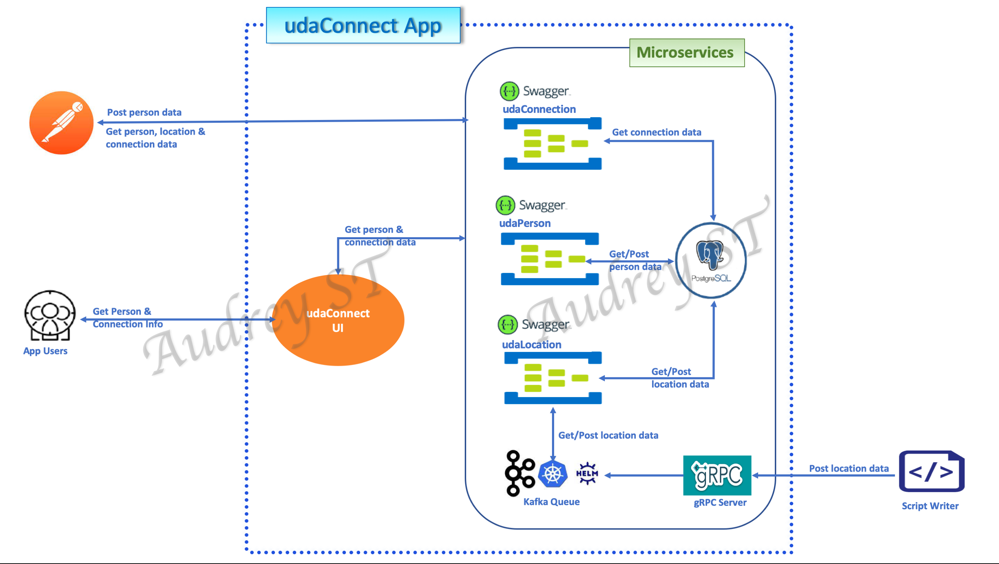

# UdaConnect
<br>
## Overview
### Background
Conferences and conventions are hotspots for making connections. Professionals in attendance often share the same interests and can make valuable business and personal connections with one another. At the same time, these events draw a large crowd and it's often hard to make these connections in the midst of all of these events' excitement and energy. To help attendees make connections, we are building the infrastructure for a service that can inform attendees if they have attended the same booths and presentations at an event.

### Goal
You work for a company that is building a app that uses location data from mobile devices. Your company has built a [POC](https://en.wikipedia.org/wiki/Proof_of_concept) application to ingest location data named UdaTracker. This POC was built with the core functionality of ingesting location and identifying individuals who have shared a close geographic proximity.

Management loved the POC so now that there is buy-in, we want to enhance this application. You have been tasked to enhance the POC application into a [MVP](https://en.wikipedia.org/wiki/Minimum_viable_product) to handle the large volume of location data that will be ingested.

To do so, ***you will refactor this application into a microservice architecture using message passing techniques that you have learned in this course***. It’s easy to get lost in the countless optimizations and changes that can be made: your priority should be to approach the task as an architect and refactor the application into microservices. File organization, code linting -- these are important but don’t affect the core functionality and can possibly be tagged as TODO’s for now!

### Technologies
* [Flask](https://flask.palletsprojects.com/en/1.1.x/) - API webserver
* [SQLAlchemy](https://www.sqlalchemy.org/) - Database ORM
* [PostgreSQL](https://www.postgresql.org/) - Relational database
* [PostGIS](https://postgis.net/) - Spatial plug-in for PostgreSQL enabling geographic queries]
* [Vagrant](https://www.vagrantup.com/) - Tool for managing virtual deployed environments
* [VirtualBox](https://www.virtualbox.org/) - Hypervisor allowing you to run multiple operating systems
* [K3s](https://k3s.io/) - Lightweight distribution of K8s to easily develop against a local cluster

## Running the app
The project has been set up such that you should be able to have the project up and running with Kubernetes.

### Prerequisites
We will be installing the tools that we'll need to use for getting our environment set up properly.
1. [Install Docker](https://docs.docker.com/get-docker/)
2. [Set up a DockerHub account](https://hub.docker.com/)
3. [Set up `kubectl`](https://rancher.com/docs/rancher/v2.x/en/cluster-admin/cluster-access/kubectl/)
4. [Install VirtualBox](https://www.virtualbox.org/wiki/Downloads) with at least version 6.0
5. [Install Vagrant](https://www.vagrantup.com/docs/installation) with at least version 2.0

<br>

<hr>

### Environment Setup
To run the application, you will need a K8s cluster running locally and to interface with it via `kubectl`. We will be using Vagrant with VirtualBox to run K3s.


## Instructions for installing student refactored UdaConnect app

<br>

### STEP 1: Prequiste software
- VirtualBox, Vagrant, k3s (use the Vagrantfile provided in this repo)
- Helm 3 (see [here](https://helm.sh/docs/intro/install/)). 
> ```
> mkdir helm
> cd helm
> curl -fsSL -o get_helm.sh https://raw.githubusercontent.com/helm/helm/master/scripts/get-helm-3
> chmod 700 get_helm.sh
> ./get_helm.sh
> ```

<br>

### STEP 2 - Start up Vagrant VM
- from the folder where you place the Vagrantfile
> ```
> vagrant up
> vagrant ssh
> sudo cat /etc/rancher/k3s/k3s.yaml
> ```
>
- copy the output from cat command to the `.kube/config` on your machine. Create one if none exist on your machine. This enables you to access k8 resources without ssh into the Vagrant VM

<br>

### STEP 3 - Deploy Kafka:
- run the following:
> ```
> helm repo add bitnami https://charts.bitnami.com/bitnami
> helm repo update
> helm install udaconnect bitnami/kafka  --set volumePermissions.enabled=true \
> --set zookeeper.volumePermissions.enabled=true
> ```
- on successful installation of kafka, you should see terminal output showing kafka consumer and broker DNS names with port (9092)
- note: A pre-generated _**kafka.yaml**_ file is included in this repo for your reference. 

<br>

<hr>

### STEP 4 - Deploy UdaConnect App
- navigate to deployment folder, run the following:
> ```
> cd deployment
> apply -f db-configmap.yaml
> apply -f db-secret.yaml
> apply -f postgres.yaml
> kubectl apply -f udaconn-person-api.yaml
> kubectl apply -f udaconn-location-api.yaml
> kubectl apply -f udaconn-grpc-api.yaml
> kubectl apply -f udaconn-connection-api.yaml
> kubectl apply -f udaconn-frontend-app.yaml
>```
- find and note the Postgress pod name
> ```
> kubectl get pods
> ```
- run the seeding script
> ```
> cd scripts
> sh run_db_command.sh <postgres_pod>
> ```
- check all resources are in working order
> ```
> kubectl get all
> ```
<br>

### STEP 5 - Endpoints for Frontend app and deployed APIs

*  `http://localhost:30000/` - Frontend App Page
*  `http://localhost:30001/` - Person OpenAPI Documentation Page
*  `http://localhost:30002/` - Location OpenAPI Documentation Page
*  `http://localhost:30003/` - Connection OpenAPI Documentation Page

<br>


### STEP 6 - Set up Postman
- import postman.json into Postman Collection, and you can start using the test suit set up for `person`, `location` and `connection` in the respective folder.
- _**Special Notes**_
> * The project starter code has the data models and schemas wronly set to INTEGER type for the primary key column instead of the SERIAL pseudo-type. This causes POST requests to `person` and `location` tables to fail when the Postgres generated id crashes with an existing id from a seeded data row. 
> * If a POST request fails with a 500 return code in the Postman, hit the SEND button a few times until the Postgres generated id advances past the existing id in the database table. Use `kubectl logs` command to view the application logs of the relevant API pod:
> ``` 
>  person API: kubectl logs --tail=15 <person-api pod>
>  location API: kubectl logs --tail=15 -c udaconnect-location-api <location api pod>
> ```

<br>

<hr>

## Architecture Diagrams



