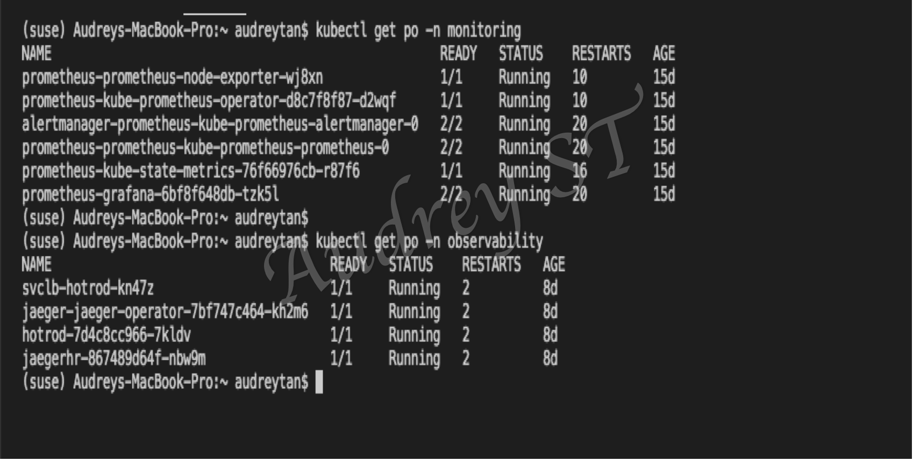
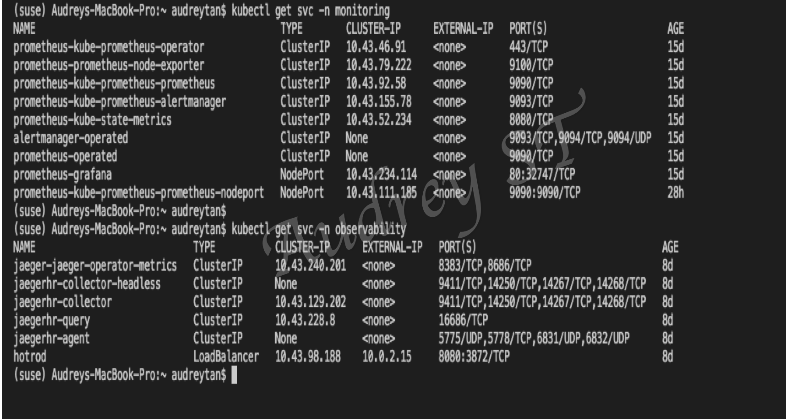
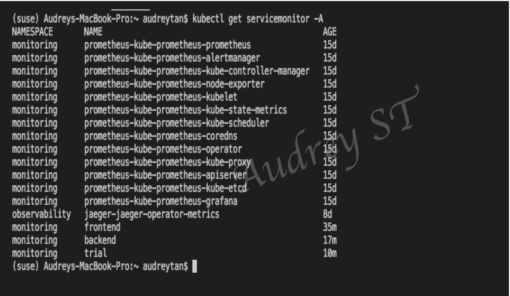
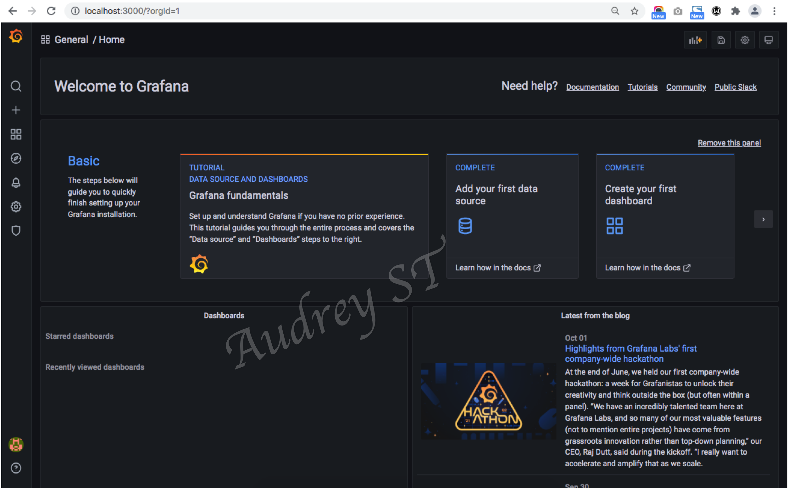
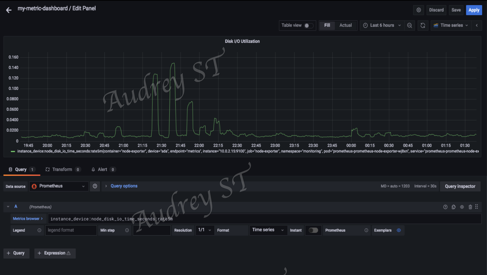
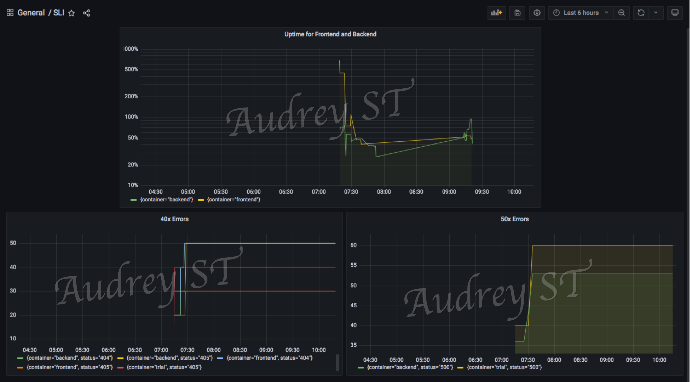
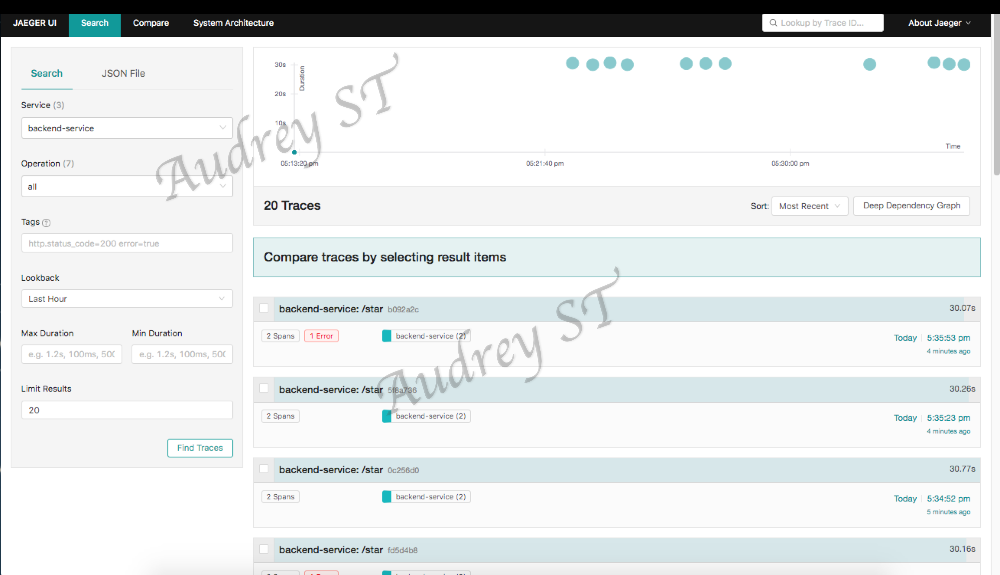
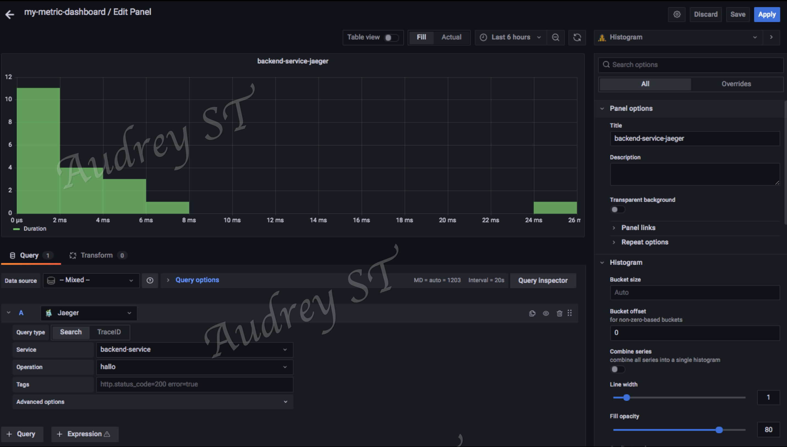
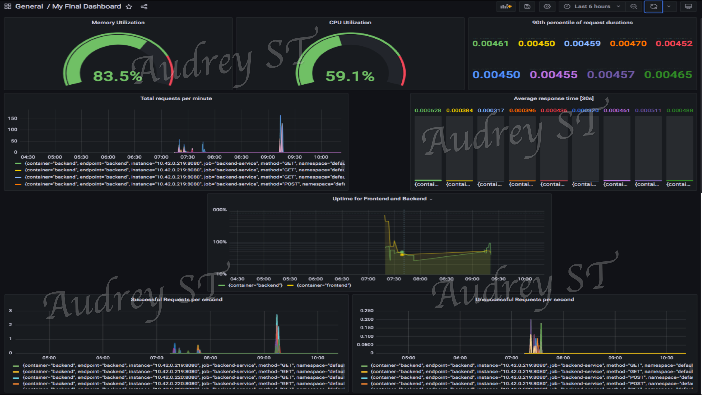

**Note:** For the screenshots, you can store all of your answer images in the `answer-img` directory.

## Verify the monitoring installation

*TODO:* run `kubectl` command to show the running pods and services for the three components. Copy and paste the output or take a screenshot of the output and include it here to verify the installation

## Setup the Jaeger and Prometheus source
*TODO:* Expose Grafana to the internet and then setup Prometheus as a data source. Provide a screenshot of the home page after logging into Grafana.

## Create a Basic Dashboard
*TODO:* Create a dashboard in Grafana that shows Prometheus as a source. Take a screenshot and include it here.

## Describe SLO/SLI
*TODO:* Describe, in your own words, what the SLIs are, based on an SLO of *monthly uptime* and *request response time*.

- SLI (Service Level Indicator) measures compliance with an SLO (service level objective).
- A SLO of `99.95%` _**monthly uptime**_ for our `backend service` means to stay in compliance, the SLI needs to meet or exceed the objective, i.e. a SLI of at least `99.95%`. 
- A SLO of below `0.4 seconds` request response time for our `frontend service` means a SLI consistently staying below or outperforming the `0.4 seconds` will land us in the clear. 

---
## Creating SLI metrics.
*TODO:* It is important to know why we want to measure certain metrics for our customer. Describe in detail 5 metrics to measure these SLIs. 

- Latency: the time taken to serve a request (usually measured in ms).
- Traffic: the amount of stress on a system from demand (e.g. the number of HTTP requests/second).
- Errors: the number of requests that are failing (e.g. number of HTTP 50x responses).
- Saturation: the overall capacity of a service (e.g. the percentage of memory or CPU used)
- Uptime: the percentage of time of a hosting platform or a webservice has been operational and available.

---
## Create a Dashboard to measure our SLIs
*TODO:* Create a dashboard to measure the uptime of the frontend and backend services We will also want to measure to measure 40x and 50x errors. Create a dashboard that show these values over a 24 hour period and take a screenshot.

---
## Tracing our Flask App
*TODO:*  We will create a Jaeger span to measure the processes on the backend. Once you fill in the span, provide a screenshot of it here.

---
## Jaeger in Dashboards
*TODO:* Now that the trace is running, let's add the metric to our current Grafana dashboard. Once this is completed, provide a screenshot of it here.

---
## Report Error
*TODO:* Using the template below, write a trouble ticket for the developers, to explain the errors that you are seeing (400, 500, latency) and to let them know the file that is causing the issue.

TROUBLE TICKET

Name: Post requests to the `/star` endpoint of the `backend service` result in 500 status code 

Date: 2021-10-04

Subject: `backend service` endpoint `/star` is fails to take new star post requests 

Affected Area: backend service - adding new stars to MongoDB

Severity: High

Description: the `/star` endpoint of the `backend service` cannot process any new request to add a new star record and returns a 500 status code. 

---
## Creating SLIs and SLOs
*TODO:* We want to create an SLO guaranteeing that our application has a 99.95% uptime per month. Name three SLIs that you would use to measure the success of this SLO.

- Service uptime of at least `99.95%`
- Average request response time under `100ms`
- At least `99.95%` of requests are successful  (Status code 200) 

---
## Building KPIs for our plan
*TODO*: Now that we have our SLIs and SLOs, create KPIs to accurately measure these metrics. We will make a dashboard for this, but first write them down here.

- Latency:
> - 90 percentile of request durations are under `100ms`
> - Average response time are under `100ms`
- Uptime:
> - Service uptime of at least `99.95%`
- Errors:
> - Number of failed responses stays below `0.2%`

---
## Final Dashboard
*TODO*: Create a Dashboard containing graphs that capture all the metrics of your KPIs and adequately representing your SLIs and SLOs. Include a screenshot of the dashboard here, and write a text description of what graphs are represented in the dashboard. 

- Memory Utilization: cluster utilization of memory in percentage.
- CPU Utilization: Cluster utilization of CPU in percentage.
- 90th percentile of request duration: the 90th percentile of request durations over the last 30 seconds, which means 90 percent of the requests finish in (min/max/avg) these times.
- Total requests per minute: total number of requests measured over one minute intervals.
- Average response time: the average response time measured over 30 seconds intervals for successful requests 
- Uptime for Frontend and Backend: uptime of the frontend and backend apps in percentage.
- Successful Requests per second: the number of successful request per second .
- Unsucessful Requests per second: the number of failed request per second. 

_**Footnotes**_: 
> * the `Memory Utilization` and `CPU Utilization` graphs show the Saturation KPI is being met.
> * the `90th percentile of request duration` and `Average response time` graphs show the Latency KPI is being met. 
> * the `Total requests per minute` graph shows the system is able to dynamically scale the number of pod (up to 3 replicas per app) to meet rising demands and satisfy the Traffic KPI.
> * the `Uptime for Frontend and Backend` graph shows the Uptime KPI is being met. 
> * the `Unsucessful Requests per second` graph shows the Error KPI is being met.

 

## Citations

#### Project Starter Code
[Udacity Github Repo](https://github.com/udacity/CNAND_nd064_C4_Observability_Starter_Files)

#### Prometheus Flask Exporter
[Prometheus Flask exporter usage](https://github.com/rycus86/prometheus_flask_exporter)

#### OpenTelementry Flask Tracing 
[OpenTelemetry Flask Instrumentation](https://opentelemetry-python-contrib.readthedocs.io/en/latest/instrumentation/flask/flask.html)

[OpenTelemetry Jaeger Thrift Exporter](https://opentelemetry-python.readthedocs.io/en/latest/exporter/jaeger/jaeger.html)

#### Prometheus Query Examples
[Prometheus Flask Exporter Example Dashboard](https://github.com/rycus86/prometheus_flask_exporter/tree/master/examples/sample-signals)

#### Distributed System Monitoring guide
[The Four Golden Signals of Monitoring Distributed Systems](https://www.metricfire.com/blog/monitoring-kubernetes-with-prometheus/#Prometheus-and-the-Four-Golden-Signals)