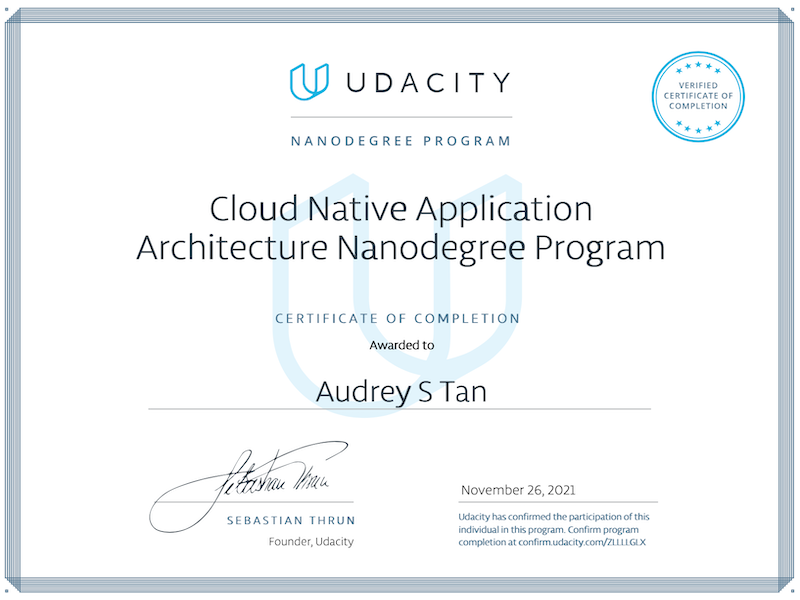
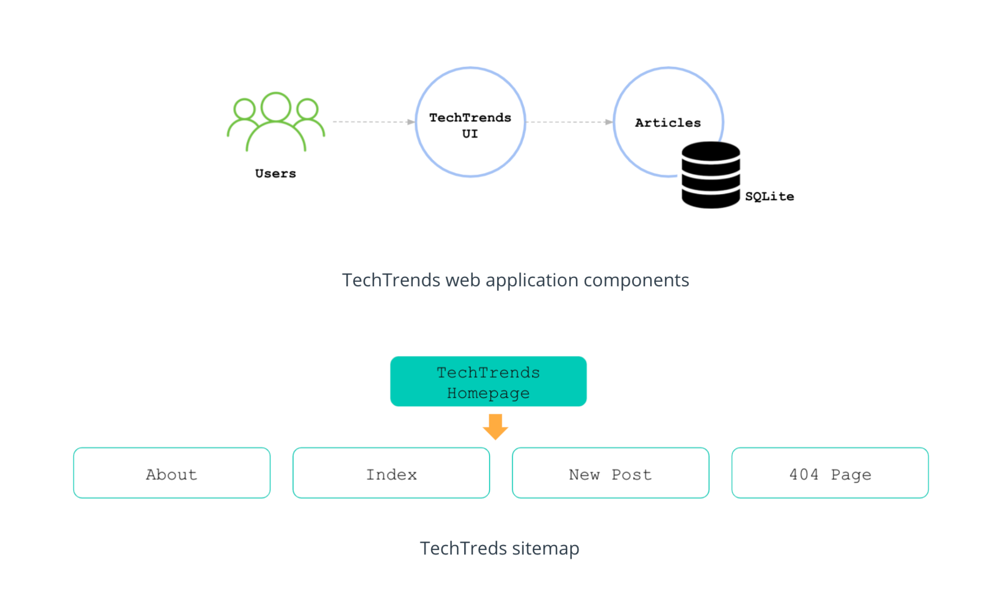
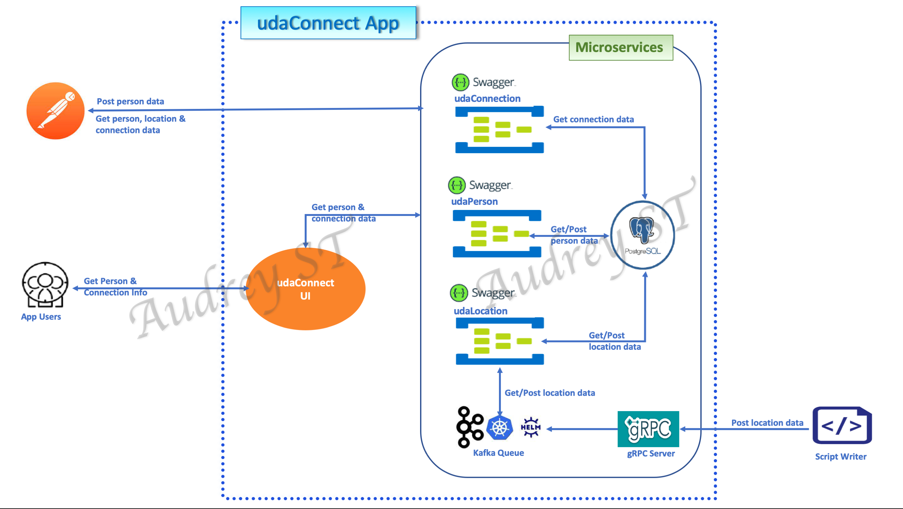
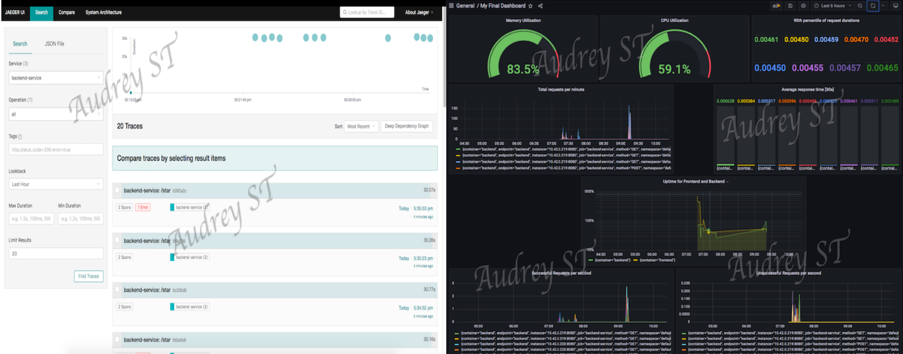
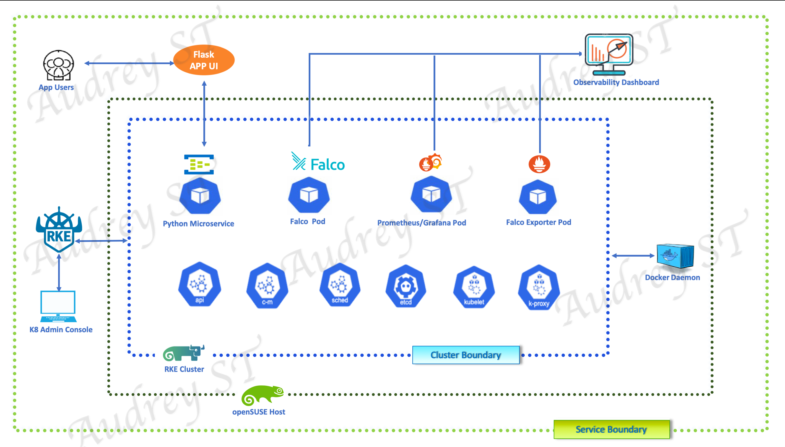
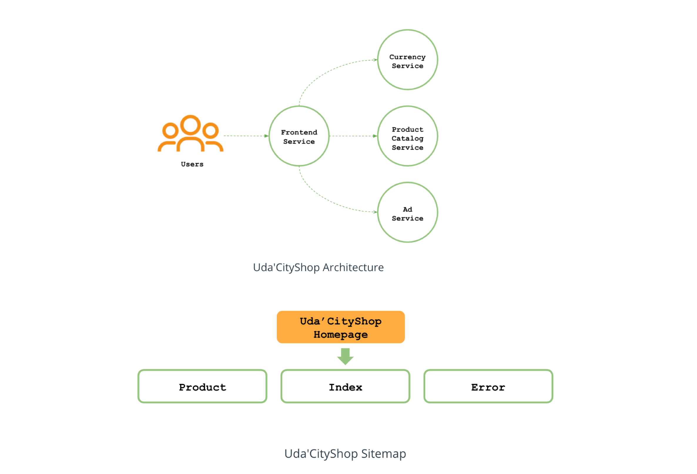

# Cloud Native Application Architecture Nanodegree (CNAAND), Udacity
I was one of the 300 CNAAND recipients chosen from the 15,000 participants in the _**SUSE Cloud Native Foundations Scholarship Program**_. This repo contains a collection of project deliverables from my CNAAND course work. 
 ---

_*A portion of project code and artifacts are stowed in secured storage to discourage improper access. For legitimate needs, please email to request access*_.

## Project Deliverables Summary
### 1. [TechTrends](https://github.com/atan4583/Cloud-Native-Application-Architecture-ND-Project-Portfolio/tree/main/Project1-TechTrends)
> * Package and deploy a fully functional online news sharing website application components to Kubernetes using `CI/CD` pipeline, with Docker image build, k3s, Kubernetes declarative manifests, Helm chart and ArgoCD for staging and production environments. The web application components and site map are as shown below (**Image credit: Udacity CNAAND Nanodegree**):
>
> 
>
> * Add health check and logging to the web app, leverage Github Action workflow and ArgoCD to implement a CI/CD pipeline to propage the web app through 3 kubernestes (`sandbox, staging and production`) environments, enabling the app to be fully tested, validated in an orderly manner before reaching the end-users fault free.
>
>
> * Project specification: refer to this [rubric](https://review.udacity.com/#!/rubrics/3084/view) 
>
>
> * Project code and artifact repository: click [here](https://github.com/atan4583/Cloud-Native-Application-Architecture-ND-Project-Portfolio/tree/main/Project1-TechTrends)
> 
>
> * Tool: VirtualBox, Vagrant, Git, Python, Docker, k3s, kubernetes, Helm, ArgoCD 
>
>
> * Artifact: [github workflow file](https://drive.google.com/drive/folders/1zoTgHeTNIaNhkvOW1le0x0SBK30IyMcd?usp=sharing), [app.py](https://drive.google.com/file/d/1SU8gVY4FOy9de_AhZ6JtjDpqokXM-m1n/view?usp=sharing), [docker_commands](https://drive.google.com/file/d/14oxQeR82p4dtF3HMlLlpRPhZ1Dh39LYM/view?usp=sharing), [k8 declarative manifests](https://drive.google.com/drive/folders/1NbE24sG4R8kWVAGxdXUDzQ1o-HmhXf_N?usp=sharing), [ArgoCD deployment manifests](https://drive.google.com/drive/folders/1hJAtVBJHzkeS6zXnR9WUms4ka9gwzJQJ?usp=sharing)
>
>
> 
 ---
### 2. [UdaConnect](https://github.com/atan4583/Cloud-Native-Application-Architecture-ND-Project-Portfolio/tree/main/Project2-UdaConnect)
> * Refactor a POC application (that ingests location data from mobile devices and identifies users in closed geographic proximity) into a microservice architecture using the appropriate message passign techniques, and deliver a MVP (Minimum Viable Product) capable of ingesting a large volume of location data. The resulting workflow is as shown below:
>
> 
>
> * Refactor the monolith `udacConnect` app into microservices consist of a Person, Location and Connection API, a frontend UI, Postgres DB, Kafka and gRPC services. 
>
>
> * Project specification: refer to this [rubric](https://review.udacity.com/#!/rubrics/2924/view)
>
>
> * Project code and artifact repository: click [here](https://github.com/atan4583/Cloud-Native-Application-Architecture-ND-Project-Portfolio/tree/main/Project2-UdaConnect)
> 
> 
> * Tool: Docker, VirtualBox, Vagrant, k3s, Helm, kubectl, Python, Flask Framework, Postgres, Postman, Kafka, gRPC, OpenAPI, [Swagger](https://swagger.io/)
>
>
> * Artifact: [architecture diagram](https://github.com/atan4583/Cloud-Native-Application-Architecture-ND-Project-Portfolio/blob/main/Project2-UdaConnect/docs/architecture_design.png), [architecture decisions](https://drive.google.com/file/d/1uuYtNIfHga_ikbsNrNrikPZONJCoY4fQ/view?usp=sharing), [refactored app deployment manifests](https://drive.google.com/drive/folders/1EjIIR4RX2VFJLVSC1hXQoUmuufz6oUxs?usp=sharing), [refactored app code](https://drive.google.com/drive/folders/1iiwQMWJiGmaU6Cx86Y_xdiJgjNJtvOi0?usp=sharing), [postman.json](https://drive.google.com/file/d/1BxMYsVpRjwtkRNVyNdWN5vthZ4L0lGY8/view?usp=sharing)
>
>
>
 ---
### 3. [Building a Metrics Dashboard](https://github.com/atan4583/Cloud-Native-Application-Architecture-ND-Project-Portfolio/tree/main/Project3-BuildingAMetricsDashboard)
> * Implement distributed tracing with Jaeger, Kubernetes resource monitoring with Prometheus and visualize the metrics with Grafana. A sample view of the artifacts is as shown below:
> 
> 
>
> * Utilize `Jaeger Operator, Jaeger instance, OpenTelemetry Flask Instrumentation` and `OpenTelemetry Jaeger Thrift Exporter` to implement distributed tracing with Jaeger on Kubernetes. Leverage `Prometheus, Prometheus Flask Exporter` with multiprocessing enabled for metrics collection, and `Grafana` to create a dashboard for the metrics.
>
>
> * Project specification: refer to this [rubric](https://review.udacity.com/#!/rubrics/2909/view)
>
>
> * Project code and artifact repository: click [here](https://github.com/atan4583/Cloud-Native-Application-Architecture-ND-Project-Portfolio/tree/main/Project3-BuildingAMetricsDashboard)
> 
> 
> * Tool: Docker, VirtualBox, Vagrant, k3s, Helm, Jaeger Operator, OpenTelemetry Flask Instrumentation, OpenTelemetry Jaeger Thrift Exporter, Prometheus, Prometheus Flask Exporter, Grafana, PromSQL 
>
>
> * Artifact: [service monitor manifests](https://drive.google.com/drive/folders/1nxnmYQx_7JiTPBd6TKesOC2KBLfQXuyf?usp=sharing), [app deployment manifests](https://drive.google.com/drive/folders/1zfTt5P_eZeJdmDJWYHX1Lrrt9U7wwL4s?usp=sharing), README.md 
>
>
> 
 ---
### 4. [Microservices Security](https://github.com/atan4583/Cloud-Native-Application-Architecture-ND-Project-Portfolio/tree/main/Project4-HardenedMicroservicesEnvironment)
> * Threat model and harden a microservice environment on a RKE cluster, implement runtime monitoring with Falco, Prometheus and Grafana. The architecture diagram below depicts the service and security boundaries of the microservice environment:
>
> 
>
> * Apply container and Kubernetes cluster threat modeling techniques and toolings leanred to build a secure and hardened Microservice environment. Leverage Falco, Prometheus and Grafana to equip the environment with runtime monitoring and threat escalation measures.     
>
>
> * Project specification: refer to this [rubric](https://review.udacity.com/#!/rubrics/3092/view)
>
>
> * Project code and artifact repository: click [here](https://github.com/atan4583/Cloud-Native-Application-Architecture-ND-Project-Portfolio/tree/main/Project4-HardenedMicroservicesEnvironment)
> 
> 
> * Tool: Docker, VirtualBox, Vagrant, RKE, Helm, kubectl, Python, Grype, Falco, Falco Exporter, Prometheus, Grafana, PromSQL
>
>
> * Artifact: security architecture diagram, [thread modeling](https://drive.google.com/file/d/15RxuYnkDu92KUUTghTzayZUgB4Yz6Pbi/view?usp=sharing), [incident response](https://drive.google.com/file/d/1l_nN1yM5wHkIYjZPLjfAqIyF7W_CB3uR/view?usp=sharing), [app.py](https://drive.google.com/file/d/18hgQgi-zpoA67cyCVfR0aDaw1DjdS2P6/view?usp=sharing)
>
>
>
 ---
### 5. [Capstone Project: Uda'CityShop](https://github.com/atan4583/Cloud-Native-Application-Architecture-ND-Project-Portfolio/tree/main/Capstone-UdacCityShop)
> * Deploy a web application composed of multiple microservices written in different programming languages to Kubernetes using a CI/CD pipeline, observe, analyze and implement changes that would optimize the existing components. The web application components and site map are as shown below (**Image credit: Udacity CNAAND Nanodegree**):
>
> 
>
> * Streamline deployment of the web app to non production and production Kubernetes environments using a CI/CD pipeline. Refactor the Java Ad microservice and rewrite it in Python to reduce the consumption of CPU and memory resources.
>
>
> * Project specification: refer to this [rubric](https://review.udacity.com/#!/rubrics/3108/view)
>
>
> * Project code and artifact repository: click [here](https://github.com/atan4583/Cloud-Native-Application-Architecture-ND-Project-Portfolio/tree/main/Capstone-UdacCityShop)
> 
> 
> * Tool: VirtualBox, Vagrant, Git, Python, Docker, k3s, Kubernetes, Helm, ArgoCD, gRPC, Prometheus, Grafana, PromSQL
>
>
> * Artifact: [github workflow files](https://drive.google.com/drive/folders/1Xq2gEcCK1BWjjL0Na3K2Urz927t7P6Om?usp=sharing), [Adservice-v2 code](https://drive.google.com/drive/folders/1gjgvBlXJ7GAxe2vyTmhhWUq6ljMg_Jbi?usp=sharing), [frontend code](https://drive.google.com/drive/folders/11piZD8UI565kel7yYC2XqnQCmsyVtj6X?usp=sharing), [grafana dashboard json](https://drive.google.com/file/d/1v1Yg4Oh3NnG8d7pZ4vzOzkJWq1RbXivI/view?usp=sharing), [grafana nodeport yaml](https://drive.google.com/file/d/1LcsRf1jtOi9u44n_VTuOiwzX5AZ3TUUG/view?usp=sharing), [argocd manifests](https://drive.google.com/drive/folders/1J8NmFHWwtRkFs_ykVzzhQHGqeYLW_w6W?usp=sharing), [Kubernetes manifests](https://drive.google.com/drive/folders/1V5zdD6Jjc95mOPoliU8JjWVknlmlX0MN?usp=sharing), [demo.proto](https://drive.google.com/file/d/1_VPBDDCEPbcGJlBP4zmk0DTiGgfRUUHq/view?usp=sharing)
>
>
>
 ---
>
>
